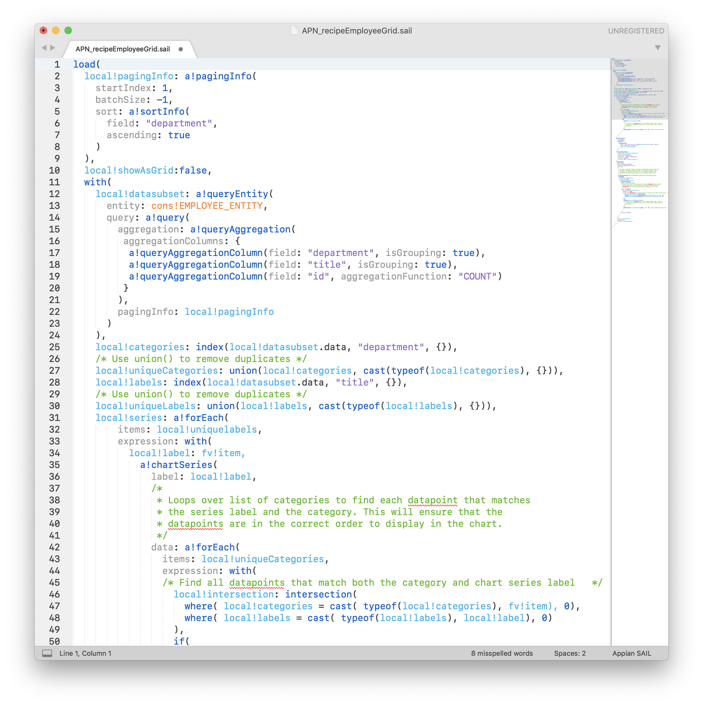

# Appian SAIL for Sublime Text

The Appian SAIL for Sublime Text package provides Appian SAIL syntax support for Sublime Text 3 and provides a Appian Expression Editor inspired color scheme. The syntax supports all Appian Functions (through 18.4) to provide code highlighting - perfect for code reviews or when writing SAIL without an internet connection.

## Features

* Syntax support for Appian SAIL code in Sublime Text 3
* Color Scheme for Sublime Text 3 that matches the Appian Expression Editor
* Easily identify deprecated Appian functions via color scheme highlighting
* Support for Appian 18.4

## Installation

1. Download the [lastest release](https://github.com/spetykowski/Appian-SAIL-for-Sublime-Text/releases/latest) of Appian SAIL for Sublime Text and unzip. 
2. Navigate the to the _Packages_ directory of Sublime Text 3 by selecting the menu bar, then `Preferences -> Browse Packages...`
3. After the Finder window opens (Explorer window for Windows users), copy the unzipped folder to this location.

## Activation

1. After installation, quit and reopen Sublime Text.
2. The syntax is available by selecting _Appian SAIL_ from the syntax picker near the bottom right corner, or by opening a file with the following extensions: `.sail`, `.appian`.
3. Activate the color scheme by navigating to the menu bar then `Preferences -> Color Scheme...` and then search for _Appian Expression Editor_.
